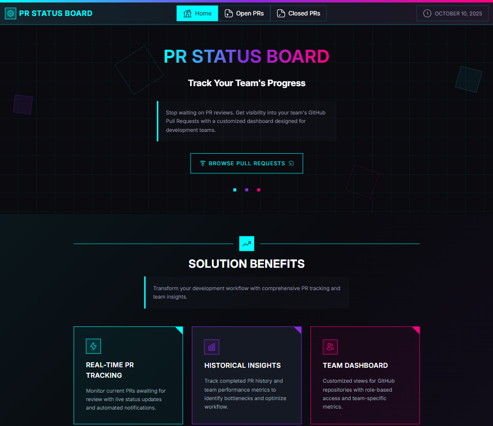

# [**PR Status Board**](https://github-prs-board.netlify.app/)

## Table of Contents

1. [Project Overview](#project-overview)
2. [Live Preview](#live-preview)
3. [Key Features](#key-features)
4. [Web App Development](#web-app-development)
5. [Our Team](#our-team)

## Project Overview 

**PR Status Board** is a web application designed to help development teams efficiently track and manage their GitHub Pull Requests (PRs).
The app provides a clear visualization of open and closed PRs, enabling teams to quickly identify which requests are awaiting review, which have been completed, and who is responsible for each task.
By integrating with **GitHub’s REST API**, the application retrieves real-time data about repositories and pull request activity, ensuring that users always have up-to-date information.
The project follows **Agile principles**, focusing on collaboration, clear communication, and creating a user-friendly experience with an intuitive and responsive interface.

## Live Preview
Check out the live version of the project here:

🌐 [PR Status Board App](https://github-prs-board.netlify.app/)

## Key Features
 
* **Repository selection** — choose which repository’s PRs to display.
* **Real-time PR tracking** — view all open and closed Pull Requests directly from GitHub.
* **Detailed PR information** — see PR number, title, author, reviewers, creation and update dates.
* **Search and filter options** — quickly find PRs by author or reviewer.
* **Error handling & validation** — clear user feedback for invalid inputs or API errors.
* **Responsive design** — optimized for both desktop and mobile devices.
* **Modern UI** — clean, intuitive interface built with React and Tailwind CSS.

## Web App Development

This project was built using modern web technologies to ensure efficiency, scalability, and a smooth user experience. Each tool played a specific role in the development process:

### [React.js + Vite](#react-js)
  - Used for building the application’s user interface and managing component-based architecture.
  - Vite provided a fast and optimized development environment with instant hot reloading and efficient build performance.
    
### [React Router](#react-router)
  - Implemented for seamless navigation between pages such as Home, Open PRs, and Closed PRs.
  - It allows dynamic routing and enhances the overall single-page application experience.
    
### [Tailwind CSS](#tailwind-css)
  - Used for creating a clean, responsive, and modern interface through utility-first styling.
  - Tailwind enabled rapid UI development and consistent design across all screen sizes.
    
### [Context API](#context-api)
  - Implemented for managing global state across the application without the need for external libraries.
  - In this project, Context was used to store repository and organization names globally, allowing components throughout the app to access and update this data easily and consistently.
    
### [GitHub API](#github-api)
  - Integrated to fetch real-time data on Pull Requests, including their status, authors, reviewers, and activity history.
  - This API provides the foundation for the app’s functionality and ensures accurate PR tracking.
  - 
### [GraphQL](#graphql)
  - Used to query GitHub data efficiently by retrieving only the required fields.
  - This not only improved performance and reduced unnecessary data fetching compared to traditional REST requests, but also allowed fetching all necessary PR data while minimizing the usage of API rate limits.
    
### [Cloudflare Workers (Environment Variables)](#cloudflare-workers)
  - Used to securely store the GitHub API token, allowing the app to access PR data without exposing the key to users.
  - This ensures safe, server-side communication with GitHub while protecting sensitive credentials.
    
### [Git](#git)
  - Used for version control and team collaboration.
  - Git allowed smooth branching, merging, and tracking of code changes, while GitHub hosted the repository and facilitated project management.
    
### [Figma](#figma)
- **UI Design**
  - Designed the application layout, color palette, typography, and interactive components such as navigation bars, tables, and buttons.
  - This ensured a consistent, accessible, and visually appealing design across all pages, which streamlined the development process.
    
- **Prototyping**
  - Created interactive prototypes to visualize the user flow and simulate functionality before development.
  - This allowed the team to identify potential UX issues early and align on interactions, saving time during implementation.

- **Collaboration**
  - Enabled designers and developers to work efficiently together, share feedback, and iterate quickly on both visual and functional aspects.
  - Figma acted as a central hub, improving team communication and speeding up the transition from design to development.

Together, these technologies provided a robust, secure, and scalable foundation for developing a modern web application that delivers both performance and usability.

## Our Team

- Chinedu Olekah, Product Owner: [GitHub](https://github.com/kenako1) / [LinkedIn](https://linkedin.com/in/chinedu-olekah)
- Ouassima EL YAKOUBI, Frontend Developer: [GitHub](https://github.com/ouassimaelyakoubi) / [LinkedIn](https://linkedin.com/in/ouassima-elyakoubi)
- Hamza EL ASSRI, UI/UX Designer : [GitHub](https://github.com/Hamza-EL07) / [LinkedIn](https://www.linkedin.com/in/hamza-elassri/)
- Ayo Alabi, ScrumMaster : [GitHub](https://github.com/AAlabi2) / [LinkedIn](https://www.linkedin.com/in/ayot/)
- Alexander Makoveev, Frontend Developer : [GitHub](https://github.com/Alexander-NM) / [LinkedIn](https://www.linkedin.com/in/alexander-makoveev)
- Nadiia Lashtun, Frontend Developer : [GitHub](https://github.com/NadiiaLashtun) / [LinkedIn](https://www.linkedin.com/in/lashtun)
- Ebhamen Joshua, Frontend Developer: [GitHub](https://github.com/Isaacjosh23) / [LinkedIn](https://www.linkedin.com/in/joshua-ebhamen-4904aa344?utm_source=share&utm_campaign=share_via&utm_content=profile&utm_medium=android_app)
